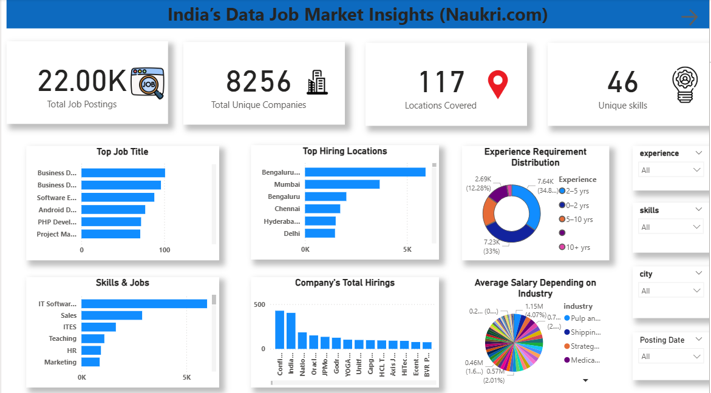

# job-market-insights-naukri# 📊 India's Data Job Market Insights (Naukri.com)

An end-to-end data analytics project to uncover hiring trends, top skills, demand hotspots, and salary insights in India's data job market using real job postings scraped from Naukri.com.

---

## 🚀 Overview

This project covers the **complete data analysis lifecycle**:

- 🕸️ **Web Scraping** job postings from Naukri
- 🧹 **Data Cleaning** & transformation
- 📊 **Exploratory Data Analysis (EDA)**
- 📈 **Interactive Dashboard** in Power BI
- 📌 **Business Insights & Market Recommendations**

---

## 📦 Dataset

- **Source:** Naukri.com job search results
- **Size:** 22,000+ job listings
- **Features:** Job title, company, location, salary, experience, skills, industry, posting date

---

## 🧪 EDA Highlights

- Top Job Titles, Locations, and Companies
- Experience level distribution
- Skills demand analysis
- Industry-wise salary trends
- Monthly hiring trends

---

## 📊 Power BI Dashboard

| Page | Description |
|------|-------------|
| **Page 1** | Overview: KPIs, Top Titles, Locations, Skills, Companies, Salary |
| **Page 2** | Insights + Recommendations: Trends, Salary vs Experience, Hiring Tips |

📸 Dashboard Previews:

---

## 💡 Key Insights

- **IT Software** is the most in-demand skill.
- **Bengaluru** is the top hiring hub.
- Most companies seek **2–5 years** of experience.
- Major recruiters: **Cognizant, TCS, Wipro, Accenture**.
- Hiring peaks in **November–December**.

---

## 🧠 Recommendations

- Learn IT Software and Sales-related skills.
- Target Bengaluru or Mumbai for better opportunities.
- 0–2 years experience roles are still significant.

---

## 🔧 Tools Used

- **Python** 
- **Power BI** (DAX, Visualizations)
- **Colab** for cleaning/EDA
- **GitHub** for version control and publishing

---

## 📎 Useful Links

- 🔗 [LinkedIn](https://www.linkedin.com/in/raine-jacob-1803b0259/)
- 🔗 [GitHub Profile](https://github.com/RaineJacob)

---

## 📌 Project Status

✅ Completed & published  
📂 Open for suggestions or improvements

---

⭐ *If you like this project, give it a star and connect on LinkedIn!*
